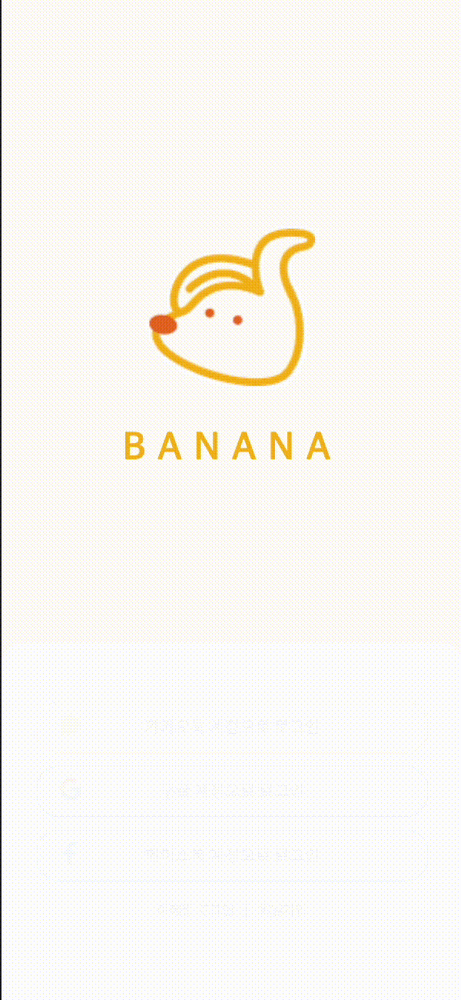
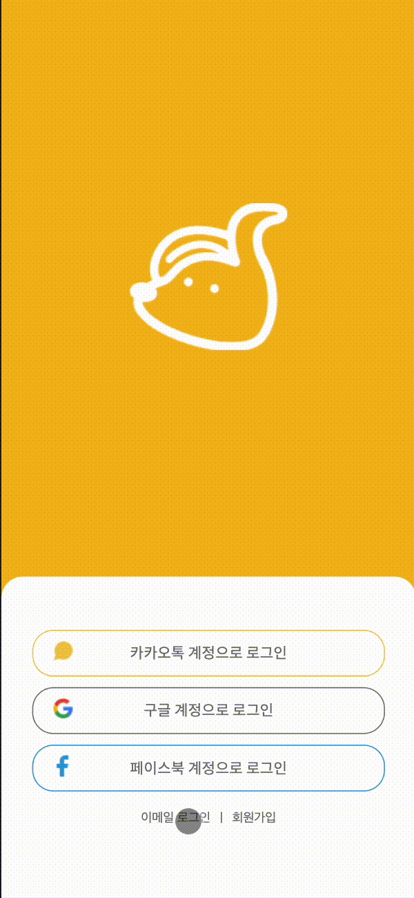
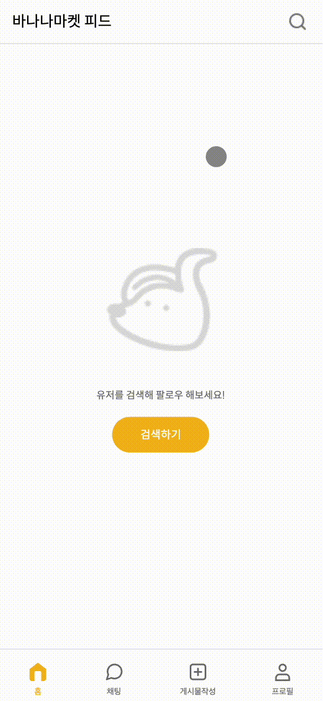
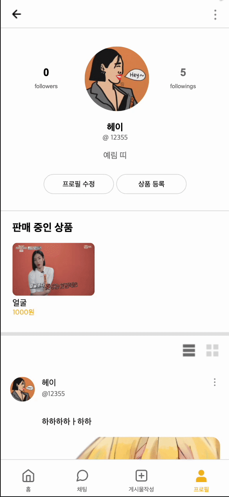

## [0. Banana Demo](https://scato3.github.io/BANANAMARKET/) 
## [바나나 피그마](https://www.figma.com/file/R69gRlt5uLIhwZvkyPZWHy/%EB%B0%94%EB%82%98%EB%82%98%EB%A7%88%EC%BC%93?node-id=0%3A1)

# 🍌바나나마켓 

바나나마켓 서비스는 자신의 스토어에서 판매하고 있는 상품을 등록하여 홍보할 수 있는 SNS입니다. <br>다양한 상품을 업로드할 수 있습니다.

상품을 등록하지 않아도 일상을 공유하며 즐거운 SNS 활동을 할 수 있습니다. <br>글과 사진과 함께 게시물을 작성하여 자신의 일상을 공유할 수 있습니다. <br>다른 사용자를 팔로우하면 유저가 올린 게시물을 홈 피드에서 소식을 확인할 수도 있습니다. <br>또한 다른 사용자와 메시지를 주고 받을 수 있습니다.

피드를 구경하다가 마음에 드는 게시물을 발견했다면 좋아요를 누를 수 있고 댓글을 남기거나 공유를 할 수도 있습니다.<br>
SNS를 통한 온라인 소통의 장 바나나마켓입니다.


## 🏃 팀원
|신현수|홍예림|안예은|서해리|한송연|
|:---:|:---:|:---:|:---:|:---:|
|[](https://github.com/scato3)|[](https://github.com/AwesomeYelim)|[](https://github.com/yeeSilver)| [](https://github.com/SeoHaeRi)| [](https://github.com/SongyeonHan)|


## 1. 구현 목표

- 바나나마켓 SNS 개발

## 2. 개발 일정

- HTML, CSS : 2021. 01. 08.
- Vanilla JavaScript : 2021. 01. 13 ~ 2021. 01. 25.

## 3. 프로젝트 구조

```
.
├── css
│    ├── components
│    │      └── navbar.css
│    └────── ...css
│   
├── img
│    ├── 2 
│    └── ...img
├── js     
│    └───── ...js
│     
└── ...html
```

## 4. 역할 분담

### 신현수

- 로그인, 회원가입 및 프로필 수정 마크업 및 기능구현
- 서치 기능구현
- 로컬 스토리지를 활용한 유저 페이지 렌더링 기능 구현, 피드 렌더링 기능 구현
- 포스팅 기능 구현 및 포스팅 모달창 기능 구현, 댓글 기능 구현
- 다른 사람 페이지 게시글 신고 기능 구현
- 상품 수정, 삭제 모달창 기능 구현 및 게시글 수정, 삭제 기능 구현


### 홍예림


- 전반적인 UI/UX 정리
- 프로젝트 로고 및 컨셉기획
- 프로젝트 전체 CSS 최적화
- 채팅 페이지 마크업 및 모달창 기능 구현
- 포스팅 마크업 및 댓글 기능 구현
- 서치 기능 및 마크업 구현
- 전체 모달창 마크업 및 기능 구현
- 좋아요 이벤트 기능 구현
- 로그인 및 회원가입 버튼 활성화 기능 구현
- 프로젝트 내브바 기능 및 최적화 구현

### 안예은

- feed, feed_initial, salePost, search otherpage 페이지 UI 구현
- salePost 페이지 (판매 상품 등록 페이지)
    * input 요소 유효성 검사 처리와 전송 버튼 구현
    * 조건 충족 시, 전송 버튼 활성화 구현
    * 이미지 서버 전송 전, 미리보기 출력
    * 판매 게시글 서버에 업로드 기능 구현
- userpage 유저 프로필 페이지
    * 유저의 판매 상품 리스트를 서버에서 불러와서 출력
    * 유저의 피드를 앨범 형식으로 출력
    * 이미지가 없는 경우, 이미지 예외처리
    * followerlist, follwinglist 페이지의 취소,팔로우 버튼 구현
- 피드 구현
    * 유저, 다른 유저의 데이터를 서버로 부터 가져와서 피드 형식으로 출력
    * 좋아요 기능 구현 (클릭 시, 서버에 좋아요 카운트 증가, 감소 반영)
- otherpage 다른 유저의 프로필 페이지 구현
- 팔로잉, 팔로우 버튼 구현
- otherfollwining list, otherfollower list 페이지
    * 취소, 팔로우 버튼 구현 (유저가 팔로잉하고 있는 타유저의 경우 취소 버튼을 출력하고 팔로잉하고 있지 않은 경우에는 팔로우 버튼 출력하기)
    * 유저 본인 계정의 버튼 예외처리


### 서해리

- 여러분의 역할을 적어주세요.

### 한송연

- 개인 프로필 페이지와 팔로우 리스트 마크업 및 UI 구현
- userpage 유저 페이지
    * 로그인한 아이디 정보에 따른 개인프로필 불러오기
- followerlist, follwinglist 팔로우 리스트 페이지
    * 현재 팔로우한 정보에 따른 리스트 불러오기

## 5. UI


<br/>

## 6. 기능

|1. Splash|2. 회원가입|
|:-:|:-:|
|||
|3. 로그인|4. 피드화면|
|||
|5. 포스팅 좋아요 및 댓글|6. 게시글 작성 및 나의 페이지|
|||
|7. 다른 사람 페이지|8. 프로필 수정|
|||
|9. 게시글 수정 및 삭제|10. 상품 등록|
|||
|11. 상품 수정 및 삭제|12. 팔로우 및 언팔로우|
|||
|13. 로그아웃|
||

## 7. 본인이 개발하며 고민했던 부분과 해결한 부분 및 느낀점 

**✍신현수님**
- 피드 부분에서 for문 안에서 innerHTML을 통해 렌더링 과정을 가졌는데 그 과정에서 생성된 요소에 모두 접근하는 것에 있어서 애로사항을 겪었는데, forEach를 통하여 각각 요소에 접근하여 함수를 처리하는 방식으로 접근할 수 있었다.

- 피드 부분에서 유저를 클릭했을 때, 그 해당 유저에 맞는 페이지가 렌더링되게 하는 부분에 있어서 애로사항이 있었는데, 페이지가 다르기 때문에 데이터를 직접적으로 넘겨줄 수 없기 때문에 로컬스토리지를 활용하여, 유저의 고유 id를 저장하여 사용하는 방식을 통해 해결할 수 있었다. 

- 프로필 및 상품 수정에서 API를 처리할 때, PUT을 해야하는 부분은 알고 있었으나, 여러 데이터를 POST, GET 과정을 하는 과정이 있었기에 어떤식으로 API를 처리할지에 대해서 고심하였고, 만들어진 모든 프로필을 최종으로 보내는 과정에서만 PUT을 활용하여 문제를 해결할 수 있었다.

- 서치페이지에서 keyup이벤트로 처리하였을 때 검색어가 IME KeyCode 229 이슈로 인해 검색을 하였을 때 하나의 아이디가 중복되서 나오는 이슈가 있었다. 그것을 해결하기 위해 input이벤트로 처리하여 해결하였다.

- 협업 과정에서 git에 대한 이해가 많이 늘 수 있었으며, 잦은 소통이 좋은 결과물을 만든다는 것을 몸소 느낄 수 있었다. 또한 자바스크립트를 배울 때 어떤식으로 쓰여야할지 막막했던 부분을 프로젝트를 하며 조금씩 채워지는 느낌이 들었고, fetch에 대한 이해와 비동기처리에 대한 이해가 많이 부족하였는데 요번 기회를 통해 이해를 늘릴 수 있는 기회가 되었다.  

**✍홍예림님**  

- 로그인 및 회원가입 버튼 활성화 부분에서 input의 value값에 각각 keyup 이벤트를 주어 해결하려 했으나, 조건문 부분에서 모든 경우의 수를 포함하지 못하는 이슈가 발생하였습니다. 이는 input을 감싸는 form태그에 이벤트를 주고, input의 value값에 대한 논리곱 연산자를 통해 해결하였습니다.

- 서치 기능에서 fetch를 통해 검색API에 접근하는 것은 성공하였으나, 입력된 값으로 서치하는 방법에 대해 고민하였습니다. 이는 data의 forEach문 속에서 입력된 값을 split으로 나누고 join을 통해 다시 그 값에 해당하는 데이터의 색을 변하게 하는 것으로 해결하였습니다.

- 전반적인 css와 splash를 수정하는 과정에서 어떻게 해야 UI적으로 깔끔하게 구현할지 고민하였고, 실제 어플이라 생각하며 불필요한 css 기능이나 코드를 정리하였습니다.


**✍안예은님**  
- [안예은 프로젝트 회고 블로그]()
- innerHTML로 생성된 요소에 접근하여 이벤트를 걸어주는 부분에서 접근 어려움이 있었다. forEach문으로 class, id 이름을 찾아 이벤트를 걸어주는 방식으로 해결을 할 수 있었으며, 이벤트 타켓 위임 방식으로도 해결할 수 있음을 알 수 있었다.

- async 함수의 반환값을 활용하는 부분이 어려웠다. 처음에는 외부 async 함수의 반환값을 가져와서 메인 async함수 안에서 처리를 하려고 했지만, Promise 값으로 반환이 되기 때문에 어떤식으로 불러와야 할 지 고민이 되었다. 메인 async 함수의 try,catch에서 외부 async 함수 값을 await을 이용하여 받아 value값을 넘겨주었다. try,catch에서 넘긴 value값을 then에서 활용하는 것이 아니라, 또 다른 함수의 인자값으로 value를 넘겨서 처리하였다. 이 기능을 구현하면서 Promise 반환값 처리를 다루는 것을 공부할 수 있었다. 

- 좋아요 반영 구현에서 하트를 클릭했을 시, 서버에 반영된 하트 개수를 브라우저에 랜딩하게 되면 새로고침이 일어나기 때문에 유저가 화면을 볼 때 부자연스러울 것이라고 생각했다. 실시간 서버를 반영하여 랜딩하는 방법이 아닌, innerText를 사용하여 마크업을 수정하는 방법으로 구현하였다. 새로고침 현상 없이 서버는 반영되고 유저는 자연스럽게 하트 개수가 올라가고 내려가는 것을 확인 할 수 있도록 하였다. 


**✍서해리님**  

**✍한송연님** 
- 현재 본인이 자바스크립트를 다루는 능력에 비해 어려운 프로젝트에 동참하게 되었는데 팀원들의 도움으로 프로젝트를 진행 할 수 있었다.
- 자바스크립트 뿐만 아니라 프로젝트를 통해 처음으로 접해본 Git 협업툴을 다루는 것에도 어려움이 많았는데 이 경험을 통해 조금이나마 다룰 수 있게 되었다. 
- 내가 해낸 것보다 도움을 받아서 할 수 있었던 것들, 기여하기보다 그 과정에서 배우는 게 더 많았던 프로젝트였기에 스스로 고민이 많았지만 팀원들의 도움으로 여기까지 올 수 있었다. 다시 꾸준히 성장하여 다음 프로젝트에선 보다 발전된 모습을 보여주고 싶다.   
